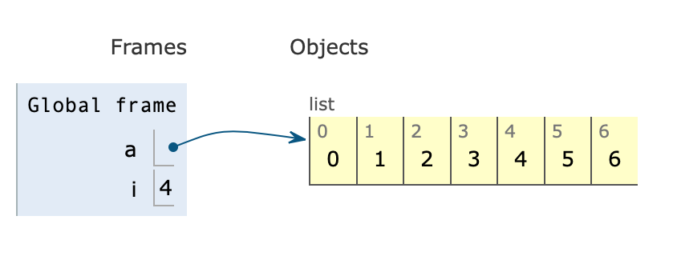
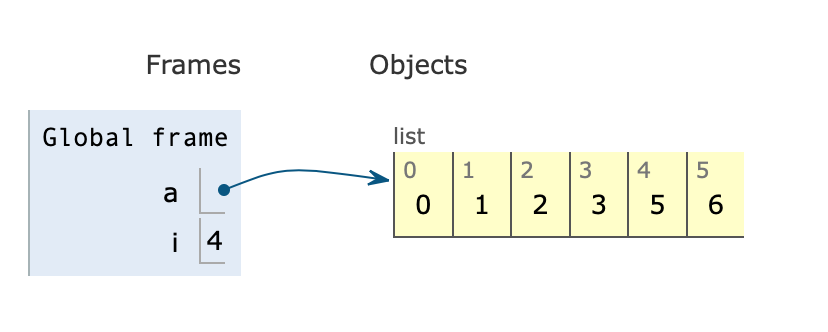
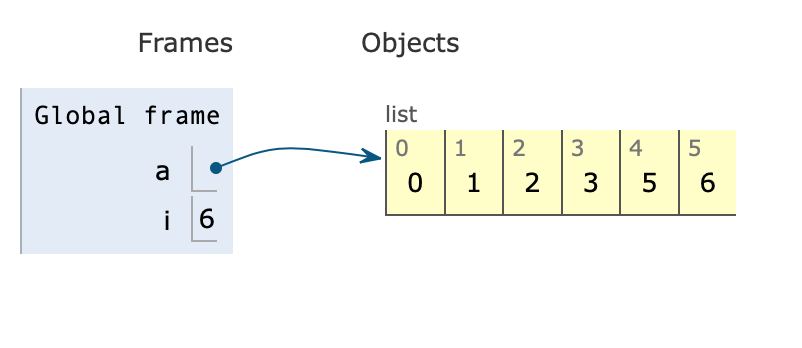
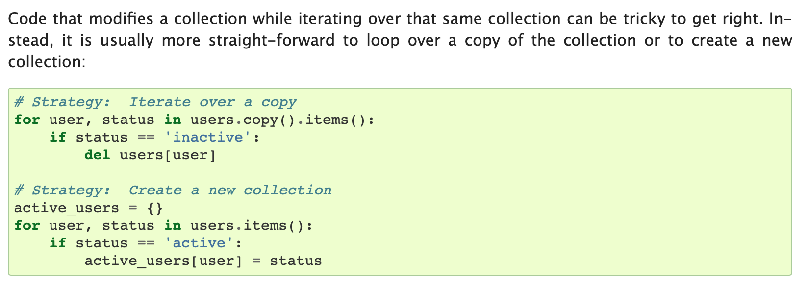

# Python for 循环中删除数据


## 例子一

看代码：

```Python3
>>> a = [0, 1, 2, 3, 4, 5, 6]
>>> for i in range(len(a)):
...     if a[i] == 4:
...             del a[i]
...
Traceback (most recent call last):
  File "<stdin>", line 2, in <module>
IndexError: list index out of range
```


一般不建议在 for loop 的时候改变 list，比如上面这个，我们想的是，它会删掉 list 中等于 4 的元素，但实际上它报错，具体我们来分析是因为这样：

 当 i == 4 的时候， a[i] == 4 成立:
 
 
 
 
a[i] 被删掉了 , 数组改变，如下：

 


但是 for loop 会依旧进行：




## 例子二

即使避开 range(), len() 函数：

```Python3
>>> lst = [0, 1, 2, 3, 4, 5, 6]
>>> for x in lst:
...     if x < 6:
...             lst.remove(x)
...
>>> lst
[1, 3, 5, 6]
```

结果也是令人头大，可以依旧在 Python Visualizer 中找到蛛丝马迹，因为我们一边在删一边在前进。删掉了 0， 同时我们前进到了 2.


换一种写法：


```Python3
>>> lst = [0, 1, 2, 3, 4, 5, 6]
>>> for i in range(len(lst)):
...     if lst[i] < 6:
...             lst.pop(i)
...
0
2
4
Traceback (most recent call last):
  File "<stdin>", line 2, in <module>
IndexError: list index out of range
```

同样令人头大，o(╯□╰)o


## 解决方案

Python 的官方 [docs](https://docs.python.org/3/tutorial/controlflow.html#for-statements) 有如下建议：




建议我们不要边 iterate 边改变 list , 建议就是最好 loop over 一个拷贝 或者 干脆建一个新的来存储。


除了这个以外，在网上看到的其它的两种解决办法：


```Python3
while i<len(your_list):
    if #condition :
        del your_list[i]
    else:
        i+=1
```


尝试:

```Python3
>>> a = [0, 1, 2, 3, 4, 4, 4, 4, 4, 4]
>>> i = 0
>>> while i < len(a):
...     if a[i] == 4:
...             del a[i]
...     else:
...             i += 1
...
>>> a
[0, 1, 2, 3]
```


另外一种就是从尾巴循环到头部：

```Python3
for i in xrange(len(somelist) - 1, -1, -1):
    element = somelist[i]
    do_action(element)
    if check(element):
        del somelist[i]
```

尝试：

```Python3

>>> a = [0, 1, 2, 3, 4, 4, 4, 4, 4, 4]
>>> for i in range(len(a)-1, -1, -1):
...     if a[i] == 4:
...         del a[i]
...
>>>
>>> a
[0, 1, 2, 3]
```

同样work, 两种选择，
