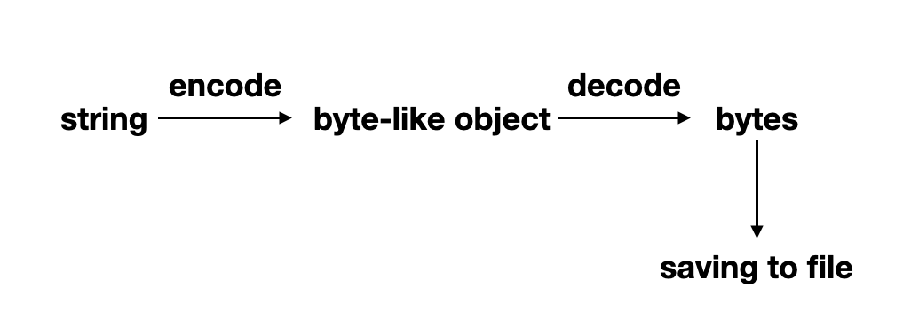

# 图片与Base64 


## Base64

假设我们网页端有 canvas：

```javascript
<canvas id="canvas" width="5" height="5"></canvas>
```

经过一些操作，


```javascript
var canvas = document.getElementById("canvas");
var dataURL = canvas.toDataURL();
console.log(dataURL);
// "data:image/png;base64,iVBORw0KGgoAAAANSUhEUgAAAAUAAAAFCAYAAACNby
// blAAAADElEQVQImWNgoBMAAABpAAFEI8ARAAAAAElFTkSuQmCC"
```

我们得到了这个图片的数据，它也明确的告诉你了： `data: image/png`, 它是 `base64` 的。那这个 base64 又是啥？

> Base64是一种基于64个可打印字符来表示二进制数据的表示方法。

图片本身是一堆 01 ，如果我们 $log_264 = 6$ 6个一组，那么可以用字符来编码。

Base64 一般来说包括：

- 26个大写字母
- 26个小写字母
- 10个数字
- `+` 和 `/` 来代表换行（有些地方可能用别的字符）


所以一共 64 个 字符，也就是 Base64.


## 存成图片

网上容易找到很多代码例子如何在 js 端存储图片，比如 [How to save svg canvas to local filesystem](https://stackoverflow.com/questions/2483919/how-to-save-svg-canvas-to-local-filesystem). 用 [FileSaver.js](https://github.com/eligrey/FileSaver.js) 也是不错的主意， 可以找到很完整的例子： [Save Canvas as Image](https://jsfiddle.net/o_oooo/3x7dcz8b/1/).

实际上后端（比如 Python） 来处理也是很容易的事情，假设后端是 Python, 收到了这一堆 dataURL，我们需要做的无非就是:


```Python3
// string of image, we only want 'iVBORw0KGgoAAAANSUhEU.....'
s_image = dataURL.split(',', 1)[1]
// encode to bytes-like object
b_image = s_image.encode()
png_file = os.path.join( output_dir, basename + '.png' )
with open(png_file, "wb") as f:
	 // decode to bytes, write to file
    f.write(base64.b64decode(b_image))
``` 


可以在 interactive shell 里测试以下更加具体的代码生成图片：

```Python3
import base64

base64_img = 'iVBORw0KGgoAAAANSUhEUgAAABAAAAAQCAYAAAAf8/9hAAAACXBIWXMAAAsTAAA' \
            'LEwEAmpwYAAAB1klEQVQ4jY2TTUhUURTHf+fy/HrjhNEX2KRGiyIXg8xgSURuokX' \
            'LxFW0qDTaSQupkHirthK0qF0WQQQR0UCbwCQyw8KCiDbShEYLJQdmpsk3895p4aS' \
            'v92ass7pcfv/zP+fcc4U6kXKe2pTY3tjSUHjtnFgB0VqchC/SY8/293S23f+6VEj' \
            '9KKwCoPDNIJdmr598GOZNJKNWTic7tqb27WwNuuwGvVWrAit84fsmMzE1P1+1TiK' \
            'MVKvYUjdBvzPZXCwXzyhyWNBgVYkgrIow09VJMznpyebWE+Tdn9cEroBSc1JVPS+' \
            '6moh5Xyjj65vEgBxafGzWetTh+rr1eE/c/TMYg8hlAOvI6JP4KmwLgJ4qD0TIbli' \
            'TB+sunjkbeLekKsZ6Zc8V027aBRoBRHVoduDiSypmGFG7CrcBEyDHA0ZNfNphC0D' \
            '6amYa6ANw3YbWD4Pn3oIc+EdL36V3od0A+MaMAXmA8x2Zyn+IQeQeBDfRcUw3B+2' \
            'PxwZ/EdtTDpCPQLMh9TKx0k3pXipEVlknsf5KoNzGyOe1sz8nvYtTQT6yyvTjIax' \
            'smHGB9pFx4n3jIEfDePQvCIrnn0J4B/gA5J4XcRfu4JZuRAw3C51OtOjM3l2bMb8' \
            'Br5eXCsT/w/EAAAAASUVORK5CYII='

base64_img_bytes = base64_img.encode('utf-8')
with open('decoded_image.png', 'wb') as file_to_save:
    decoded_image_data = base64.b64decode(base64_img_bytes)
    file_to_save.write(decoded_image_data)
```

中间有的这些转换是： 

- 首先有图片的 string, base64_img 字符串
- 把 base64\_img 转化成 base64\_img\_bytes, 这是 bytes-like object 类似字节对象
- 以binary写模式打开文件，再把这个 bytes-like object 类似字节的对象转成 bytes，存入文件


值得注意的有 bytes-like object:

> An object that supports the Buffer Protocol and can export a C-contiguous buffer. This includes all bytes, bytearray, and array.array objects, as well as many common memoryview objects. Bytes-like objects can be used for various operations that work with binary data; these include compression, saving to a binary file, and sending over a socket.

它是遵循 Buffer 协议，经常用于压缩、存二进制文件、在 socket 中传输。虽然我们 `type(base64_img_bytes)` 它会告诉我们它是 `<class 'bytes'>`. 不过它的确是 bytes-like object, 并且我们可以通过比如 `decode` 或者简单的

```
data = str(base64_img_bytes, 'utf-8')
// str: 'iVBORw0KGgoA... 
```

来得到 string.


注意这个对 '真正的 bytes' 是不行的，比如我们 `type(decoded_image_data)`, 结果依旧是 `<class 'bytes'>`，但是如果我们尝试把它变成 string：

```
>>> data = str(decoded_image_data, 'utf-8')
Traceback (most recent call last):
  File "<stdin>", line 1, in <module>
UnicodeDecodeError: 'utf-8' codec can't decode byte 0x89 in position 0: invalid start byte
```

报错！同时我们其实也可以直接来看变量内容，比如 `base64_img_bytes` 是 `b'iVBORw0K...'`, 而 `decoded_image_data` 则是 `b'\x89PNG\r\n\x1a\n\...`


这里用的 `decodebytes`， 结果跟上面的 `b64decode` 其实一样，看到更多的地方用的是 `b64decode `.

一张图片来说明整个过程做的事：




## 读取图片


当然也可以做相反的事情，比如上面的 `base64_img` 这个 string 是如何得到的呢？其实是从图片中得到的：

```Python3
import base64

with open('logo.png', 'rb') as binary_file:
    binary_file_data = binary_file.read()
    base64_encoded_data = base64.b64encode(binary_file_data)
    base64_message = base64_encoded_data.decode('utf-8')

    print(base64_message)
```


这里直接读进来的 `binary_file_data ` 是 `b'\x89PNG\r\n\x1a\n\...`， `base64_encoded_data ` 是 `b'iVBORw0K...'`， 最终的 `base64_message ` 则是 str 字符串 `'iVBORw0K...`


参考：

- [HTMLCanvasElement.toDataURL()](https://developer.mozilla.org/zh-CN/docs/Web/API/HTMLCanvasElement/toDataURL)
- [Base64](https://zh.wikipedia.org/wiki/Base64)
- [how to save canvas as png image?](https://stackoverflow.com/questions/11112321/how-to-save-canvas-as-png-image/11112370)
- [Encoding and Decoding Base64 Strings in Python](https://stackabuse.com/encoding-and-decoding-base64-strings-in-python/)
