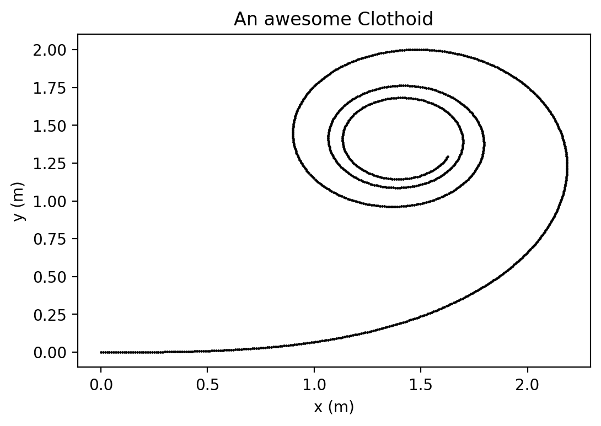
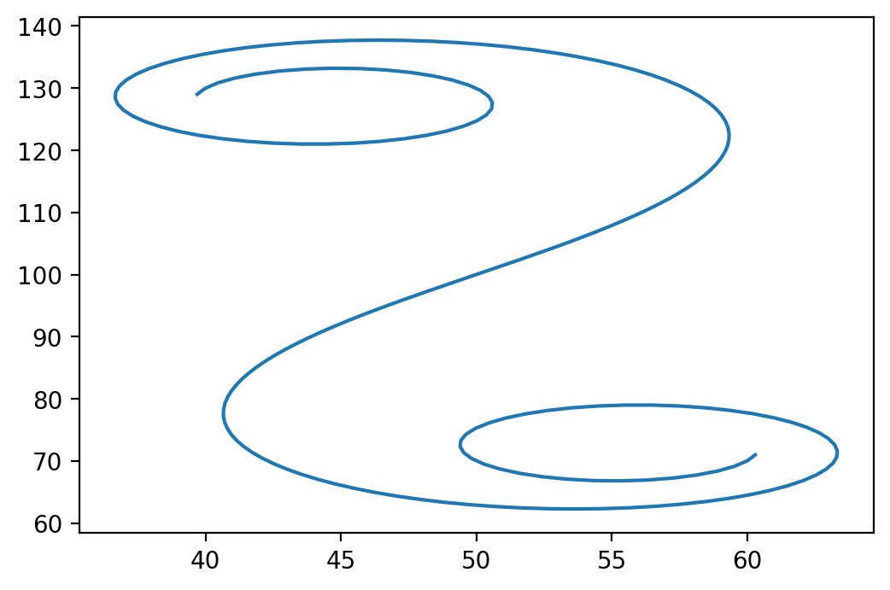

欧拉螺线（Euler spiral）/ 羊角螺线（clothoid）之前有写过，它的特性是  An Euler spiral is a curve whose curvature changes linearly with its curve length。 它的曲率随着它的曲线长度线性地改变。

> An Euler spiral is a curve whose curvature changes linearly with its curve length (the curvature of a circular curve is equal to the reciprocal of the radius). Euler spirals are also commonly referred to as spiros, clothoids, or Cornu spirals.

线性改变总是一种有意思的特质，clothoid 也因为它的这个性质，存在于很多地方，比如过山车🎢，公路的连接：

> Clothoid 是使人们上下颠倒的环行游乐设施的理想曲线。在此之前，人们始终认为这种游乐设施的逻辑形状是圆形。实际上，如果过山车绕一圈成环，则该环的入口具有相当大的曲率，从而向乘客施加强大的离心力。另一方面，当汽车到达圆上的最高点时，其加速度会降低，以致乘客有可能跌倒。


但 clothoid 并不好画，看它的中文 Wikipedia 页面：

$$
x = C(t)\\
y = S(t)
$$

其中 C(t), S(t) 是 菲涅耳积分 （Fresnel integral）


$$
S(x)=\int _{0}^{x}\sin(t^{2})\,dt=\sum _{{n=0}}^{{\infty }}(-1)^{n}{\frac  {x^{{4n+3}}}{(4n+3)(2n+1)!}} \\
C(x)=\int _{0}^{x}\cos(t^{2})\,dt=\sum _{{n=0}}^{{\infty }}(-1)^{n}{\frac  {x^{{4n+1}}}{(4n+1)(2n)!}}.
$$


所以想要画它，思路之一就是使用 Fresnel 积分，比如这个 StackOverflow 提供的答案：

[Python - OpenDrive Map - Spiral / Clothoid / Euler Spiral / Cornu Spiral Interpolation using Fresnel Integrals
Ask Question](https://stackoverflow.com/questions/48884655/python-opendrive-map-spiral-clothoid-euler-spiral-cornu-spiral-interpo)


第二个思路是直接 sin, cos 积分：

[Computing Clothoid Curves in five lines of Python](https://medium.com/@alejandro.blumentals/computing-clothoid-curves-in-five-lines-of-python-3ea762debaa1)


```python
import numpy as np
from scipy.integrate import odeint
import matplotlib.pyplot as plt
plt.rcParams['figure.dpi'] = 200

def clothoid_ode_rhs(state, s, kappa0, kappa1):
    x, y, theta = state[0], state[1], state[2]
    return np.array([np.cos(theta), np.sin(theta), kappa0 + kappa1*s])
def eval_clothoid(x0,y0,theta0, kappa0, kappa1, s):
    return odeint(clothoid_ode_rhs, np.array([x0,y0,theta0]), s, (kappa0, kappa1))
```


```python
x0,y0,theta0 = 0,0,0
L = 10
kappa0, kappa1 = 0, 0.4
s = np.linspace(0, L, 1000)

sol = eval_clothoid(x0, y0, theta0, kappa0, kappa1, s)

xs, ys, thetas = sol[:,0], sol[:,1], sol[:,2] 
plt.scatter(xs, ys, s = 0.5, c = 'k')


plt.xlabel('x (m)');
plt.ylabel('y (m)');
plt.title('An awesome Clothoid');


```





```python
import numpy as np
from math import cos, sin, pi, radians, sqrt
from scipy.special import fresnel
import matplotlib.pyplot as plt


def spiral_interp_centre(distance, x, y, hdg, length, curvEnd):
    '''Interpolate for a spiral centred on the origin'''
    # s doesn't seem to be needed...
    theta = hdg                    # Angle of the start of the curve
    Ltot = length                  # Length of curve
    Rend = 1 / curvEnd             # Radius of curvature at end of spiral

    # Rescale, compute and unscale
    a = 1 / sqrt(2 * Ltot * Rend)  # Scale factor
    distance_scaled = distance * a # Distance along normalised spiral
    deltay_scaled, deltax_scaled = fresnel(distance_scaled)
    deltax = deltax_scaled / a
    deltay = deltay_scaled / a

    # deltax and deltay give coordinates for theta=0
    deltax_rot = deltax * cos(theta) - deltay * sin(theta)
    deltay_rot = deltax * sin(theta) + deltay * cos(theta)

    # Spiral is relative to the starting coordinates
    xcoord = x + deltax_rot
    ycoord = y + deltay_rot

    return xcoord, ycoord

fig = plt.figure()
ax = fig.add_subplot(1, 1, 1)

# This version
xs = []
ys = []
for n in range(-100, 100+1):
    x, y = spiral_interp_centre(n, 50, 100, radians(56), 40, 1/20.)
    xs.append(x)
    ys.append(y)
ax.plot(xs, ys)

fig.savefig('spiral.png')
plt.show()
```




