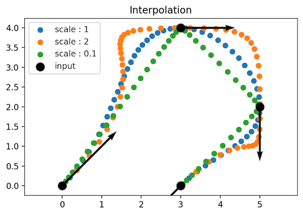

## Numpy Axis


比如我有 numpy array：


```python
import numpy as np

a = np.asarray([[1, 2],
                [3, 4],
                [5, 6],
                [7, 8],
                [9,10]])
```

我知道 `a[0]` 是 `array([1, 2])`, 而 `a[:,0]` 是 `array([1, 3, 5, 7, 9])`，  而 axis 则是下面的这种：


比如 `np.sum(a, axis = 0)` 会给我 `array([25, 30])`， 也就是把 col 分别加起来。而 `np.sum(a, axis = 1)` 结果为  `array([ 3,  7, 11, 15, 19])`， 是把每个 row 加起来。 


看上面的图，也许更加容易理解， `axis = 0` 是 纵向的操作， `axis = 1` 是横向的操作。当然，这个也经常写作 `a.sum(0)` 和 `a.sum(1)`. 同时我们知道 numpy array 中的很多操作和 Python3 中的很多操作是对应起来的，比如 `a**2` 就是把 array 中每个数都平方，这个时候如果 a 中的每个 row 都是一个 vector，那么它们的 l2 norm 都可以容易的得到：

```
(a**2).sum(1) 

#array([  5,  25,  61, 113, 181]) 
```


## Reshape (-1,1)

reshape 是 Numpy 中的常用函数， 当 reshape 中给can -1 的意思就是：

> 如果等于-1的话，那么Numpy会根据剩下的维度计算出数组的另外一个shape属性值。

这里有一个很好的回答 →  [Python中reshape函数参数-1的意思？](https://www.zhihu.com/question/52684594/answer/157491724)

举个例子，比如我想取单位圆上的一堆点，我可以这样来做：


```python
ts = np.linspace( 0, 2 * np.pi, 5 )
pts = np.hstack( ( np.cos(ts).reshape(-1,1), np.sin(ts).reshape(-1,1) ) )
```


上面是什么意思呢？ 首先我有 ts， 然后我的 np.cos(ts).reshape(-1,1) 是给我类似以下的结果：

```
array([[ 1.00000000e+00],
       [ 7.07106781e-01],
       [ 6.12323400e-17],
       [-7.07106781e-01],
       [-1.00000000e+00]])
```

也就是我 指定它是一列，它会自己推断行数，同理处理 np.sin(ts).reshape(-1,1). 最终给我的是这堆点：


```python
import matplotlib.pyplot as plt

plt.scatter(pts[:,0], pts[:,1], label = 'points')


plt.axis('equal')
plt.title('Interpolation')
plt.legend()
plt.show()
```


## Matplotlib 画箭头

quiver 可以用来画矢量，简单看一下参数是 `quiver(X,Y,U,V)`, X, Y 箭头起点， U，V 箭头方向。

下面的简单例子就是比如画出点和它们所在的 tangent。


```python
pts = np.asarray( [ [1,0], [0,1] ])
tangents = np.asarray( [ [0,1], [-1,0] ])
```


```python
import matplotlib.pyplot as plt

plt.scatter(pts[:,0], pts[:,1], label = 'points')
plt.quiver(pts[:,0], pts[:,1], tangents[:,0],tangents[:,1])


plt.axis('equal')
plt.title('Interpolation')
plt.legend()
plt.show()
```


还记得之前的这个例子， [Cubic hermit spline interpolation python](https://stackoverflow.com/questions/36644259/cubic-hermit-spline-interpolation-python) ， 我们也可以使用 quiver 把 tangent 画出来：



## Pytest

最后再为 Pytest 打一波 call， 简直太好用了，比如我有文件 `file.py`，里面有 `func`， 还有 `test_func_01(), test_func_02()...`, 使用 `pytest file.py` 它会帮助我们自动找到里面以 test 开头的函数，然后进行测试，甚至还能用它配合 pdb 来用 `pytest --pdb file.py`,如果我想单独测试一个函数可以： `pytest file.py::test_func_01`

## 坑

最后在上次的 Python Code Vectorization 中其实默默的踩了一个坑，那就是 2D 中的点和 3D 中的点 叉积是不一样的， 2D 中的向量，叉积默认是 z 方向，所以就是一个数字, 而 3D 中的叉积则是一个向量。 这大概也有点数学定义的需要注意的。

