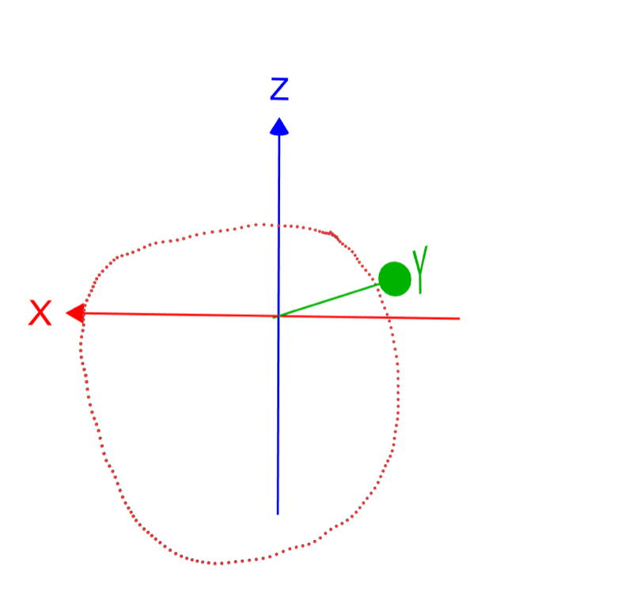
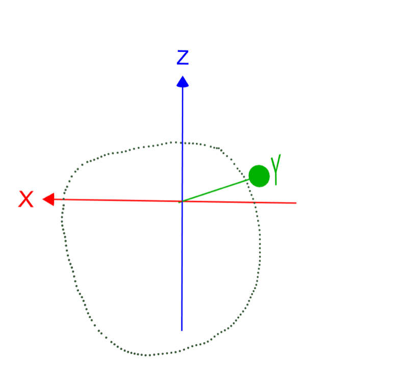
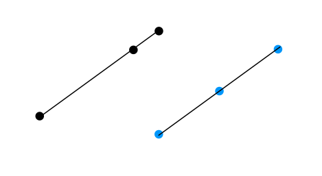
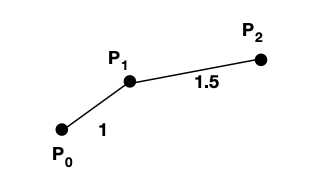
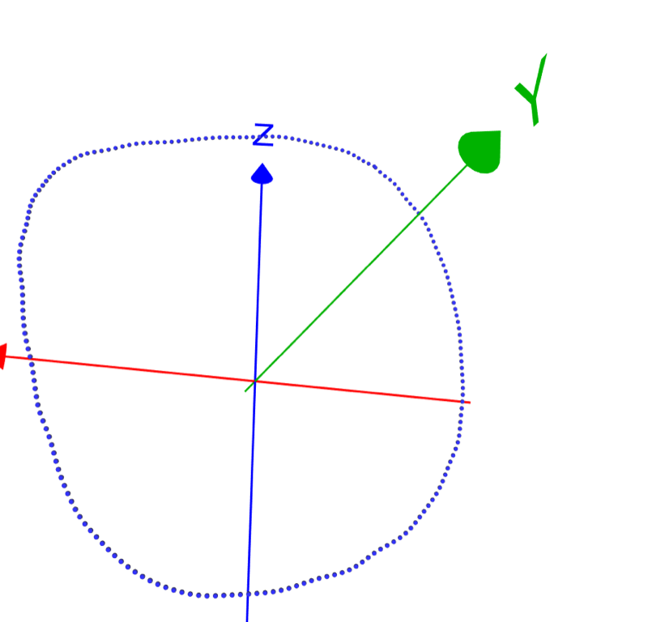
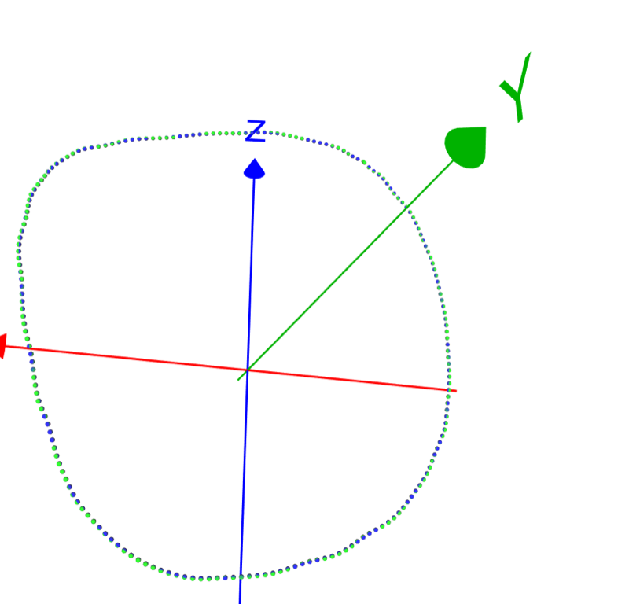

# Resample 和 Smooth

简单的随手记录📝，假设我收集了一堆点，我想从中重新采样：




有几个原因会让我想 resample：

- 采集的方式不同，数据密集程度不同
- 即使是同一次采集，点与点之间也不均匀分布
- 重复的点/间距太小只想要一个
- 只想要100个数据
- ...


## 思路一

所以最简单的想法是，比如我有 `raw_curve_points`, 那么我采集第一个点，与第一个点距离 0.01 以上的点，依此往后：

```
same_point_threshold  = 0.01 
## remove duplicated/very close point
resampled_curve_points = []
for raw_curve_point in raw_curve_points:
    # https://stackoverflow.com/questions/1401712/how-can-the-euclidean-distance-be-calculated-with-numpy
    if resampled_curve_points == [] or np.linalg.norm(resampled_curve_points[-1] - raw_curve_point) > same_point_threshold:
        resampled_curve_points.append( raw_curve_point )
```

这样的结果是：



说实话，在这个情况下看起来还可以，不过看起来也不是特别均匀分布，原因是采样的点一定是来自于原来的点中。然后有些地方比如下一个点比较远就是远了。

但是比如在另一些情况下可能就不是那么靠近我们想要的，比如有三个点：[0,0], [9,9],[10,10]， 那么采样下来就还是这4个点。我们可能就更想要比如 [0,0], [5,5], [10,10].或者看下面这个图：



黑色是原始状况，蓝色是我们想要采样后的结果（或者更多‘均匀’的点）。


## 思路二

所以我们会出现的思路就是根据上面的提示来，我们根据弧长来采样，可以写下如下代码：

```
# will protect, make sure len(points) >= 2
def sample(points, s):
    """
    Given:
        points: [P0, P1, ..., Pn-1] raw points
        s: arclength
    Return:
        point on P at arclength s
    """
    cur_length = 0
    for i in range(len(points)-1):
        length = np.linalg.norm(points[i+1] - points[i])
        if cur_length + length >= s:
            alpha = (s - cur_length) / length
            result = lerp(points[i], points[i+1], alpha)
            return result
        cur_length += length


def lerp(v0, v1, t):
    return (1 - t) * v0 + t * v1
```

代码的原理很简单，比如我们想采样弧长 s 处的点，我们先减去前面没有达到的部分，然后再做插值，比如下图我们想要一个弧长 s = 2 的点P，那么我们就是在 $P_1, P_2$ 之间做插值。




那么我们想采样一系列的点就可以：

```
def resample(points, inc = 0.01):
    """
    Given:
        points: [P0, P1, ..., Pn-1] raw points
        inc: sampling rate of the curve, 1cm
             can modify to other sampling rate, e.g. how many points
    """
    length = 0
    for i in range(len(points)-1):
        length += np.linalg.norm(points[i+1] - points[i])

    num = int( length / inc )

    q = []
    for i in range( num ):
        q.append(sample(points, i * inc))
    return q
```

重新采样上面红色点：


看起来平均很多，但是点的数量也上去了，毕竟弯弯折折全加到长度中去，

- # raw_data_points = 179
- # 思路一 = 156
- # 思路二 = 205


当然我也可以容易控制采样数量。

## Smooth

另外可以做的一件简单的事情是 - smooth， 因为可以看到采样的数据是有点凹凹凸凸的，那么能想到的最简单的平滑方式就是所谓的  box blur, 就让我来求平均试试看吧:

同样，最简单的 smooth:

```
def smooth(points):
    q = [ points[0] ]
    for i in range(1, len(points)-1):
        p = ( points[i-1] + points[i] + points[i+1] ) / 3
        q.append(p)
    q.append( points[-1])
    return q
```

加上第一点和最后一点是为了防止闭合不给力的情况，o(╯□╰)o




看起来并没有太大的变化， 把原本的点也就在图中：



不过平滑目前不是我考虑的重点，或许更大的 box（加上 weights) 或者 Gaussian blur 能带来更好的平滑效果，所以暂时就这样或者不平滑也行？