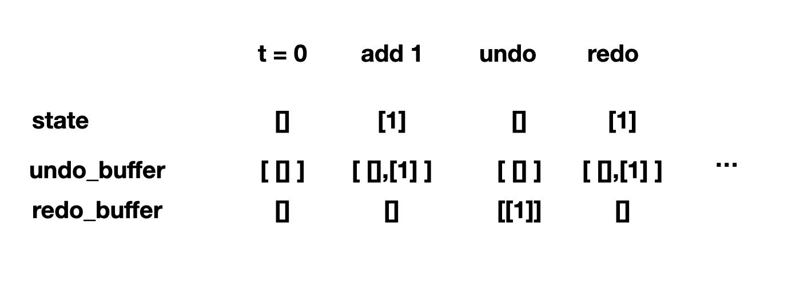

可能在 software engineer 看来这是很简单和习以为常的操作 undo（撤销）， redo（重做），简单记录一下实现原理，比如最简单的，我们的状态 state 是一个 list（当然一般来说应该是比 list 复杂更多的东西）, 我们可能会对 state 的操作就是往里面添东西（实际的操作也可能更加复杂），那么我们想要实现 undo/redo 怎么做呢？


很简单，我们用另一个 list 来记录 state， 这样就可以回到之前的状态了，啊，我第一次听到这个想法真是要鼓掌，如果不考虑效率内存这是很好的办法。同时我们可以再用一个 list 来记录 undo 的时候产生的一些东西，这样也可以达到 redo。 👏👏👏

但实际动手写一个最简单的demo都踩坑了几个坑 o(╯□╰)o


### deepcopy

list/dict 首先肯定需要注意的是需要 deepcopy， 否则牵一发而动全身 : ) 

然后我在大神的指引下写下了第一版，逻辑如下：

- 首先把最初的 state 存入 undo_buffer
- save_state_for_undo: 每次我做了一些操作，我都把新的 state 存在 undo_buffer 中，然后同时把 redo_buffer 更新为空。
- undo: 当我调用undo 的时候，这个时候首先它会检查我里面是否存了一些新的 state， 我把最新的 state pop 出来放到 redo_buffer 中，同时返回到前一个 state
- redo: 如果 redo_buffer 中有东西，则我可以把它变成最新的 state，同时我把这个 state 存入 undo_buffer 中

```
# v1
from copy import deepcopy

def test( ):
    state = []


    undo_buffer = [ deepcopy( state ) ]
    redo_buffer = []

    def save_state_for_undo():
        undo_buffer.append( deepcopy( state ) )
        del redo_buffer[:]

    def undo():
        if len(undo_buffer) > 1:
            redo_buffer.append( undo_buffer.pop() )
            state = deepcopy( undo_buffer[-1] )
    
    def redo():
        if len(redo_buffer) >= 1:
            state = deepcopy( redo_buffer[-1] )
            undo_buffer.append( redo_buffer.pop() )
    
    
    state.append(1)
    print("after modifcation", state)

    save_state_for_undo()
    print("now I do a undo")
    undo()
    print("state after undo", state)
    
    print("now I do a redo")
    redo()
    print("state after redo", state)


test()
```

注意这里有一些值得注意的地方：因为我一开始就在 undo_buffer 中放东西了，所以 undo/redo 检测的条件有所不同。

稍微想了一下，感觉这样是安全的：




### nonlocal

但是实际测试的时候发现 undo 之后 state 并没有任何变化，o(╯□╰)o，打印出了 undo 和 redo function 中的 state 发现了是 variable scope 的问题，我以为 undo/redo 都是在 test 里面，所以当然 access 的 state 就是 test 下面的 state， 这真是让我疑惑了一会。

寻找了一会，看到一个可能靠谱的答案：

https://stackoverflow.com/questions/1281184/why-cant-i-set-a-global-variable-in-python

但我这个也不是 global variable 啊， 有点奇怪，但是还是试着用了 Python3 的关键字 nonlocal:


```
# v2
from copy import deepcopy

def test( ):
    state = []


    undo_buffer = [ deepcopy( state ) ]
    redo_buffer = []

    def save_state_for_undo():
        undo_buffer.append( deepcopy( state ) )
        del redo_buffer[:]

    def undo():
        nonlocal state
        if len(undo_buffer) > 1:
            redo_buffer.append( undo_buffer.pop() )
            state = deepcopy( undo_buffer[-1] )
    
    def redo():
        nonlocal state
        if len(redo_buffer) >= 1:
            state = deepcopy( redo_buffer[-1] )
            undo_buffer.append( redo_buffer.pop() )
    
    
    state.append(1)
    print("after modifcation", state)

    save_state_for_undo()
    print("now I did a undo")
    undo()
    print("state after undo", state)
    
    print("now I do a redo")
    redo()
    print("state after redo", state)


test()
```

这样就跟我预期一样了，o(╯□╰)o， 然后做了更多的测试，比如 append 3个数，然后 undo/redo >= 3 次，发现应该是安全的，o(╯□╰)o， 先假装 undo/redo 的原理就是这样了。


