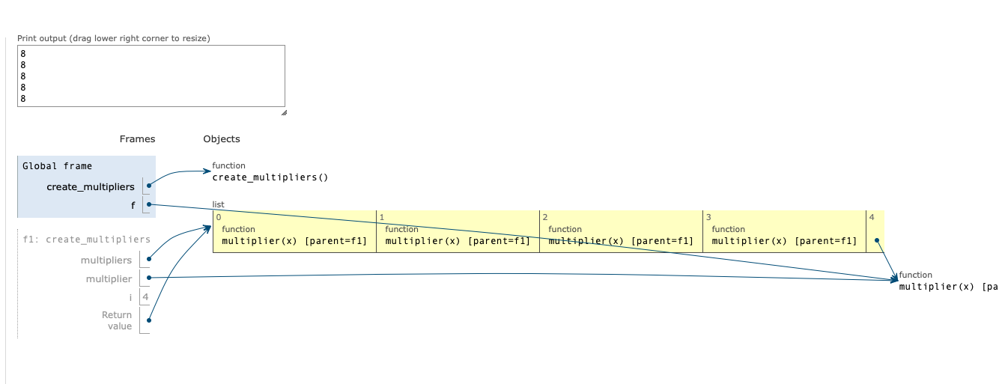
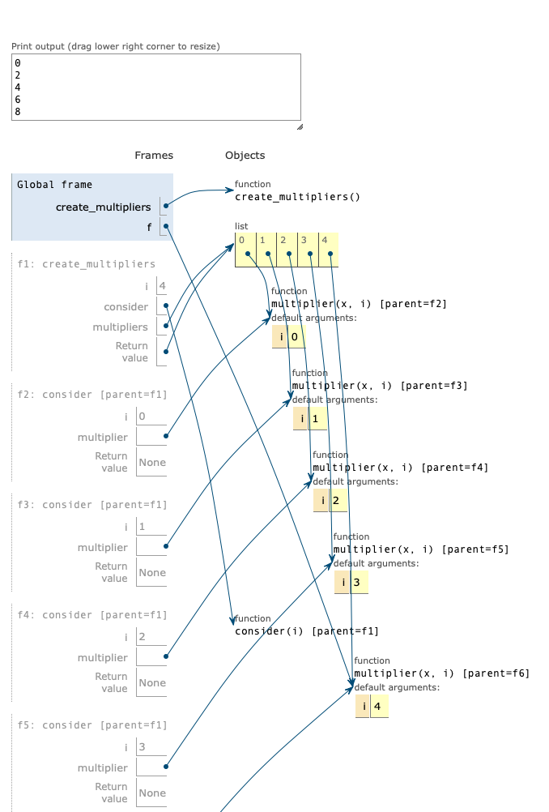

# list作为默认参数以及late binding

这篇文章可以理解为 [Common Gotchas](https://docs.python-guide.org/writing/gotchas/#common-gotchas) 的翻译/笔记.


# 可变的数据类型作默认参数

假设有这个函数：

```
def f(a, L=[]):
    L.append(a)
    return L
```

你的理解可能是：

```
f(1) # [1]
f(2) # [2]
```

实际情况：

```
[1]
[1, 2]
```

这个问题实际上在 Python offical documentation 中也有出现[4.7.1. Default Argument Values](https://docs.python.org/3/tutorial/controlflow.html#default-argument-values):

问题是是 default value 只会 evaluate 一次，所以只有一个 list 创建了。


> Important warning: The default value is evaluated only once. This makes a difference when the default is a mutable object such as a list, dictionary, or instances of most classes.

你甚至可以用一下代码来验证：

```
def f(a, L=[]):
    L.append(a)
    print( id(L) )
    return L
```

所以涉及到可能需要用可变的数据类型（list，dictionary， instance of a class） 来做默认参数的时候我们一般都是：

```
def f(a, L=None):
    if L is None:
        L = []
    L.append(a)
    return L
```


# Late binding

late binding的例子，看这个，比如我们有创建了 5 个函数：


```
def create_multipliers():
    multipliers = []

    for i in range(5):
        def multiplier(x):
            return i * x
        multipliers.append(multiplier)

    return multipliers
```

如果我们直接 print 这个函数的结果，会是：

```
[<function create_multipliers.<locals>.multiplier at 0x7f992a1006a8>,
 <function create_multipliers.<locals>.multiplier at 0x7f992a100620>,
  <function create_multipliers.<locals>.multiplier at 0x7f992a100598>,
  <function create_multipliers.<locals>.multiplier at 0x7f992a100510>, 
  <function create_multipliers.<locals>.multiplier at 0x7f992a1008c8>]
```

按照我的理解，这五个函数就是 [ 0 * x, 1 * x, 2 * x, 3 * x, 4 * x],那么如果我们用一下：

```
for f in create_multipliers():
    print( f(2) )
```

结果却是：

```
8
8
8
8
8
```

不是我们预料之中的 0, 2, 4, 6, 8, 结果全是 8 = 4 * x，这是因为 Python 的 closure 是 late binding：

> Python’s closures are late binding. This means that the values of variables used in closures are looked up at the time the inner function is called.


这里有一个解答不错：

[Python中后期绑定(late binding)是什么意思？](https://www.zhihu.com/question/29483144/answer/44526309)

> 你定义一个函数，函数内的变量并不是立刻就把值绑定了，而是等调用的时候再查找这个变量，如图，定义函数的时候没有 foo 变量，但是仍然可以，只要调用的时候环境里有就行。


那么问题就是在于这里的 i 没有被记住，所以文章给的解决办法是：

```
def create_multipliers():
    return [lambda x, i=i : i * x for i in range(5)]
```

因为我没有那么习惯使用 lambda 函数，我大可以这样：

```
def create_multipliers():
    multipliers = []

    for i in range(5):
      def consider( i ):
        def multiplier(x, i = i):
          return i * x
        multipliers.append(multiplier)
      consider( i )

    return multipliers
```


本质一样，这样使用上面的测试函数就能得到我们预期的数据了，实际上我们可以看一下两端代码运行的 stack:



很明，这个 multiplier(x) [parent=f1] 都是指向的同一个 function.




当我们用了上面的代码记住了 i 之后，可以看到，每次都记住了我们想要的函数。


划重点！！！⚠️⚠️⚠️

所以有的时候比如我想记住函数以及它周围的 local variable 的时候，记得提醒我自己 late binding!!


