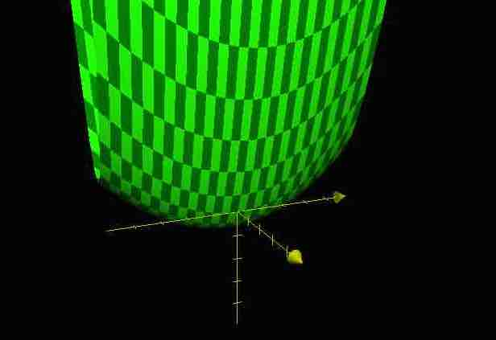
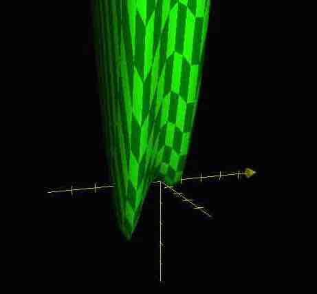

梯度下降方法基于以下的观察：如果实值函数 $F(\mathbf{x})$ 在点 $\mathbf{a}$ 处可微且有定义，那么函数 $F(\mathbf{x})$  在 $\mathbf{a}$  点沿着梯度相反的方向 $ -\nabla F({\mathbf{a}})$ 下降最多。

因而，如果 ${\mathbf {b}}={\mathbf  {a}}-\gamma \nabla F({\mathbf {a}})$ 对于 $ \gamma >0 $为一个够小数值时成立，那么 $F({\mathbf  {a}})\geq F({\mathbf  {b}})$。

考虑到这一点，我们可以从函数 F 的局部极小值的初始估计 ${\mathbf  {x}}_{0}$ 出发，并考虑如下序列 ${\mathbf  {x}}_{0},{\mathbf  {x}}_{1},{\mathbf  {x}}_{2},\dots$ 使得

$$\mathbf{x}_{n+1}=\mathbf{x}_n-\gamma_n \nabla F(\mathbf{x}_n),\ n \ge 0.$$

因此可得到

$$F({\mathbf  {x}}_{0})\geq F({\mathbf  {x}}_{1})\geq F({\mathbf  {x}}_{2})\geq \cdots ,$$

如果顺利的话序列$({\mathbf  {x}}_{n})$ 收敛到期望的局部极小值。注意每次迭代步长$\gamma$ 可以改变。


## 例子一： 一元函数


假设我有函数 $f(x) = 4x^2 + 10x + 10$, 极值很容易知道， 求导或者画图，我们可以求出在  $f'(x) = 8x + 10 = 0$, 也就是 $x = - 1.25$ 处取得极小值. 极值点是在 $f'(x) = 0$ 处得到，根据上面的描述可以简单的写出 Python 代码：


```Python3
def f(x):
    return 4 * x**2 + 10 * x + 10

def dfdx(x):
    return 8 * x + 10

def gradient_descent( x0 ):    
    stepsize = 1e-3
    gtol = 1e-7
    
    ## Start at x0
    x = x0
    g = 2*gtol + 1
    while True:
        ## Stop when the gradient vanishes
        if g <= gtol: break
        
        ## Move in the negative gradient direction
        g = dfdx(x)
        x -= stepsize * g
        
        ## Print our state
        print( "g:", g )
        print( "x:", x )
    
    return x

gradient_descent( 0 )
```

最终经过很多次迭代，结果为 

```
g: 9.948920265401284e-08,
x: -1.249999987663339
```

x 非常靠近 -1.25 ，毕竟 floating number. 这里的收敛条件是导数 小于 1e-7，实际上极值点是导数为0，但这个限制也算合理.


wikipedia 上也有例子，不过它的终止条件更多，还包括迭代次数：

```Python3
x = 6  # Starting point
step_size = 0.01
step_tolerance = 0.00001
max_iterations = 10000

# Derivative function f'(x)
df = lambda x: 4 * x**3 - 9 * x ** 2

# Gradient descent iteration
for j in range(max_iterations):
    step = step_size * df(x)
    x -= step

    if abs(step) <= step_tolerance:
        break

print('Minimum:', x) # 2.2499646074278457
print('Exact:', 9/4) # 2.25
print('Iterations:',j) # 69
```

## 例子二： 二元函数

当我们把函数变成二元的，也就是：

$$
f(x, y) = x^2 + 0.1y^2 + 2x
$$

肉眼or配方也容易看出来极小值取得点为 $x = -1, y = 0$， 画个图：



把上面的函数稍作升级也依然可用：

- 导数 → 梯度
- 导数为0 → 梯度的模为0

```Python3
from numpy import *

def f(x,y):
    return x**2 + .1*y**2 + 2*x

def dfdx(x,y):
    return asfarray(( 2*x + 2, .2 * y ))

def gradient_descent( x0,y0 ):
    stepsize = 1e-3
    gtol = 1e-7
    
    ## Start at x0
    x,y = x0,y0
    g = (2*gtol + 1)*ones(2)
    while True:
        ## Stop when the gradient vanishes
        if (g**2).sum() <= gtol: break
        
        ## Move in the negative gradient direction
        g = dfdx(x,y)
        x,y = asfarray((x,y)) - stepsize * g
        
        ## Print our state
        print( f"|g( {x}, {y} )|^2: {(g**2).sum()}" )
    
    return x,y

x,y = gradient_descent( 0,0 )
print( "f(x,y):", f(x,y) )
```

最后给我们的结果是：

```Python3
|g( -0.9998422907923933, 0.0 )|^2: 9.988792881925946e-08
f(x,y): -0.9999999751278058
```

也算误差范围内合理。


## 例子三： 多个极值的多元函数

再来一个例子：

$$
f(x,y)=x^{4}+2x^{3}-x^{2}-x+y^{2}
$$

这个时候就比较难一眼看出来了o(╯□╰)o，画个图：



大概会有两个极值点，依旧用上面的思路，只需更改：


```Python3
def f(x,y):
    return x**4 + 2*x**3 - x**2 - x + y**2


def dfdx(x,y):
    return asfarray(( 4*x**3 + 6*x**2 - 2*x - 1, 2*y ))
```

如果从 $x = 1, y = 0$ 开始的话，结果是：

```Python3
|g( 0.5000447338339464, 0.0 )|^2: 9.94574627101316e-08
f(x,y): -0.4374999929957363
```

如果从 $x = -1, y = 0$开始的话：

```Python3
|g( -1.7070818625844628, 0.0 )|^2: 9.925013669616886e-08
f(x,y): -2.6642135584968853
```


当然大概用 [scipy.optimize](https://docs.scipy.org/doc/scipy/reference/tutorial/optimize.html) 就能解决问题了，o(╯□╰)o，不过读一点和写一点这种 code snippet 还是可以增强理解。


## 导数连续

那么最重要的点包括：

- 整个计算过程中我们根本不需要 f(x,y)，当然，有了导数就万事大吉了，当然最终求极值是多少的部分还是需要函数的定义
- 导数一定要是连续的，否则比如这样的函数 $y = |x|$ 的极值在它导数没有定义的点，就有点麻烦


这就是为什么我们见到的那么多 energy function/ object function / loss function 是平方的，一方面我们想要它去除掉比如正负的偏差，另一方面我们想要它们的导数是连续的。当然还有比如不是平方的值，奇次方的很多时候都是负无穷。

如果去看 [Test functions for optimization](https://en.wikipedia.org/wiki/Test_functions_for_optimization)  这个页面，发现大部分的都是带平方的。


## 只有 f(x)

有的时候我们只有一个像 black box 的 f(x), 我们无法写出准确的数学定义，此时我们依旧有很多工具可以用，比如我们可以用 finite element method 来求模拟导数，因为导数实际上就是：

$$
f'(x) = \frac{f(x+h) - f(x)}{h}
$$

所以不断的代入 f(x) 也可以模拟出导数


还有比如利用 Taylor 级数展开 f(x) 到二次，然后来计算，还有新兴的 autograd 之类的 o(╯□╰)o


## Debug Optimization


当我们使用 `scipy.optimize` 之类的模块来做事的时候，有的时候可以一步一步来：

- 0 energy test： 先传入我们知道的最优的情况，看它会不会帮我们优化，如果这个它还要优化，那就必然有问题了
- perturbation test: 改变一个参数，加一点小小的扰动，看它能否把我们优化回到理想状态
- more challenging situation: 给参数更大的改变，看它表现如何
- plus others: 再加上别的参数的改变


当然打印出来整个迭代过程，看优化的走向也能帮助我们。


参考：

- [梯度下降法](https://zh.wikipedia.org/wiki/梯度下降法)
- [Gradient descent](https://en.wikipedia.org/wiki/Gradient_descent)


