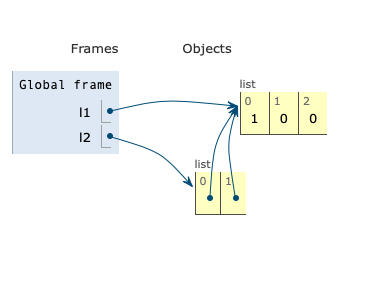
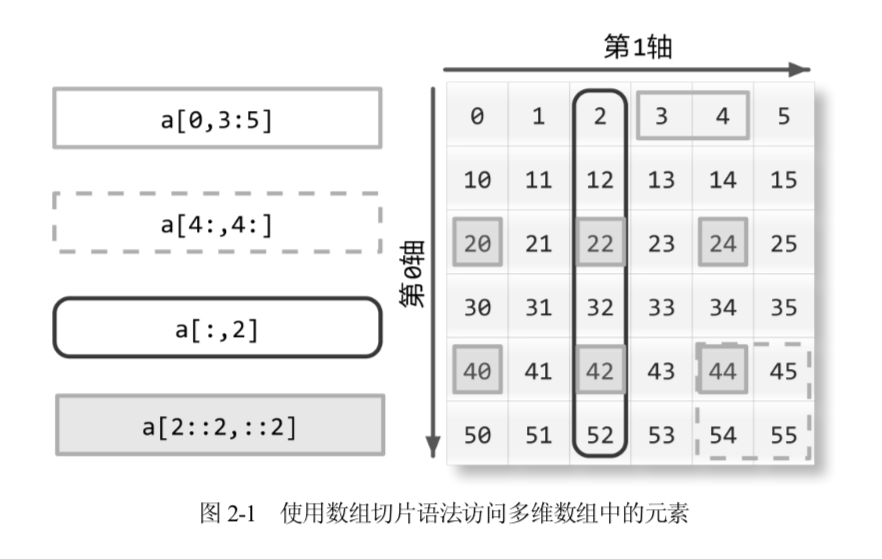
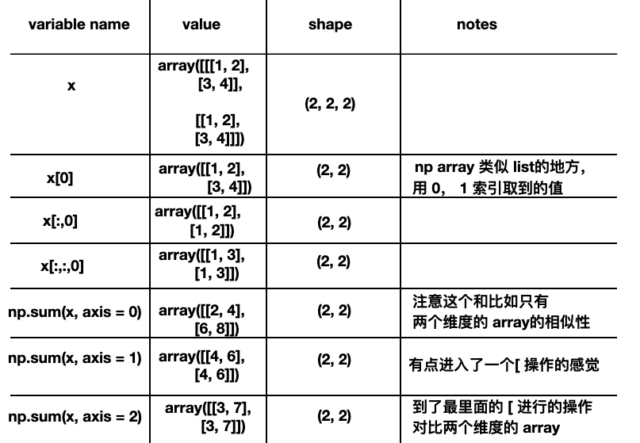

# 欢迎

这里我会随手记录📝一些关于 Python 使用的踩坑和技巧。

## 踩过的坑🕳

- [建立嵌套列表踩坑](https://zhuanlan.zhihu.com/p/63391914)

实际上这包含了比如 内存、id、指针 知识。


```
l = [0 for i in range(3)] # l = [0,0,0]

l  = [[0 for i in range(3)] for j in range(2)]  # l = [[0, 0, 0], [0, 0, 0]]


l1 = [ 0, 0, 0 ] 
l2  = [l1] * 2  # l2 = [ [0,0,0] , [0,0,0] ] 
l2[0][0] = 1  # l2 = [ [1,0,0], [1,0,0]]
```




也可以同时阅读 [变量不是盒子是标签](https://zhuanlan.zhihu.com/p/64128472) 同时理解。

- [Python for 循环中删除数据](https://zhuanlan.zhihu.com/p/87418417)

```
a = [0, 1, 2, 3, 4, 5, 6]
for i in range(len(a)):
    if a[i] == 4:
            del a[i]
```

会报错 IndexError: list index out of range， 具体分析见文章。


## 技巧 🔨

- [d.get(k, default) 代替d[k]](https://zhuanlan.zhihu.com/p/63546549)

如果字典里没有某个 key， 直接 d[k] 会 raise KeyError，有时候为了流畅，可以直接：


```
occurrences = index,get(word, [])
occurrences.append(location)
index[word] = occurrences
```

- [写出更 Pythonic 的类](https://zhuanlan.zhihu.com/p/63390938)

```
class XXX:
	...
	
    def __len__(self):
        return len(self._cards)

    def __getitem__(self, position):
        return self._cards[position]
```

- [Python Code Vectorization](https://zhuanlan.zhihu.com/p/262279042)

Numpy Array 的运算很多时候和单个元素的运算都是一致的运算符

```
>>> a = 3
>>> a ** 2
# 9
>>> a = np.array([1,2,3])
>>> a**2
# array([1, 4, 9])
```


很多时候我们不用去做一个 for loop， 一个一个处理， 使用 Array Programming，让我们的速度更上一层楼。


- [Numpy Axis, Reshape, Matplotlib 画箭头](https://zhuanlan.zhihu.com/p/266050727)

Numpy Axis 是一个很重要的概念：





> The way to understand the “axis” of numpy sum is that it collapses the specified axis. So when it collapses the axis 0 (the row), it becomes just one row (it sums column-wise).

看例子：

```
>>> a
array([[1, 2, 3],
       [4, 5, 6],
       [7, 8, 9]])
>>> a.shape
(3, 3)
>>> np.sum(a, axis = 0)
array([12, 15, 18])
>>> np.sum(a, axis = 1)
array([ 6, 15, 24])
```

再看一个例子：

```
>>> x
array([[[1, 2],
        [3, 4]],

       [[1, 2],
        [3, 4]]])
>>> x.shape
(2, 2, 2)
>>> np.sum(x, axis = 0)
array([[2, 4],
       [6, 8]])
>>> np.sum(x, axis = 1)
array([[4, 6],
       [4, 6]])
>>> np.sum(x, axis = 2)
array([[3, 7],
       [3, 7]])
```



Pytorch 或者 Tensorflow 的 tensor 的维度也是一样的概念 🔽：

```
>>> t1 = torch.tensor([[1, 2, 3], [4, 5, 6]])
>>> t2 = torch.tensor([[7, 8, 9], [10, 11, 12]])
>>> torch.cat([t1,t2], 0)
tensor([[ 1,  2,  3],
        [ 4,  5,  6],
        [ 7,  8,  9],
        [10, 11, 12]])
>>> torch.cat([t1,t2], 1)
tensor([[ 1,  2,  3,  7,  8,  9],
        [ 4,  5,  6, 10, 11, 12]])
```

## 大杂烩


- [ Undo/Redo 实践](https://zhuanlan.zhihu.com/p/144379355)